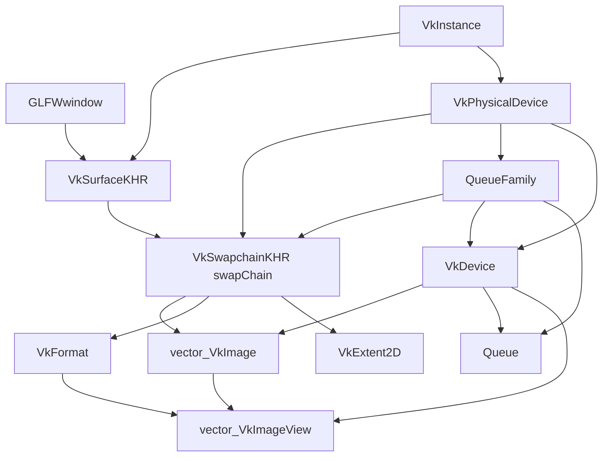

```mermaid
graph TD;
    A[GLFWwindow];
    B[VkInstance];
    C[VkSurfaceKHR];
    D[VkPhysicalDevice];
    E[VkSwapchainKHR swapChain];
    F[QueueFamily];
    G[VkDevice];
    H[vector_VkImage];
    I[VkFormat];
    J[VkExtent2D];
    K[Queue];
    L[vector_VkImageView];

    A-->C;B-->C;B-->D;C-->E;
    D-->E;D-->F;D-->G;F-->E;
    F-->G;E-->H;G-->H;E-->I;
    E-->J;F-->K;G-->K;H-->L;
    I-->L;G-->L;
```